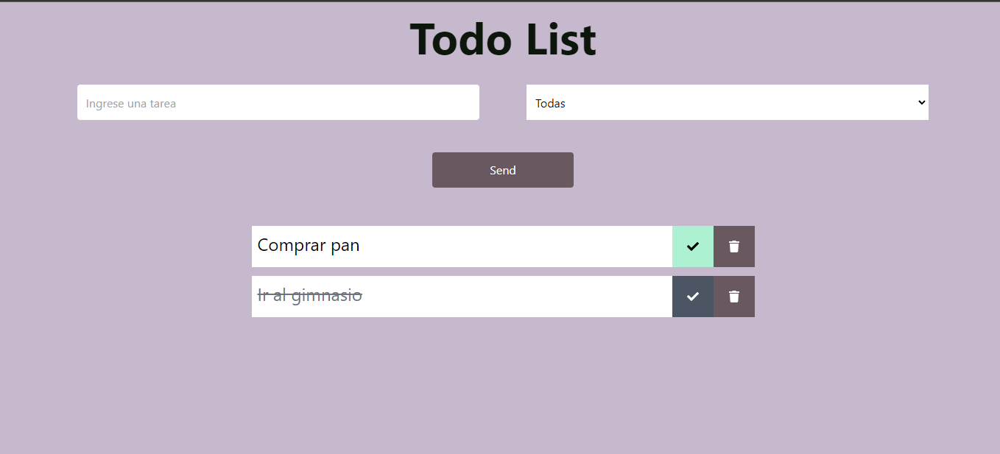
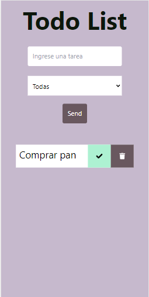

## Todo list React

#### Es una aplicación de React que permite hacer una lista de tareas, marcar las tareas completas y poder eliminarlas  

#### Para visualizar la página [click aqui]([https://todo-list-react-five-mauve.vercel.app/])

#### Funcionalidades
- ##### Se pueden agregar tareas.
- ##### Se pueden eliminar las tareas.
- ##### Se pueden marcar como completas o incompletas.
- ##### Se pueden filtrar las tareas según si estan comples o incompletas.

##### Cuenta con una interfaz responsiva, lo que significa que podrás acceder y utilizar la aplicación tanto en computadoras de escritorio como en tablets y celulares.

